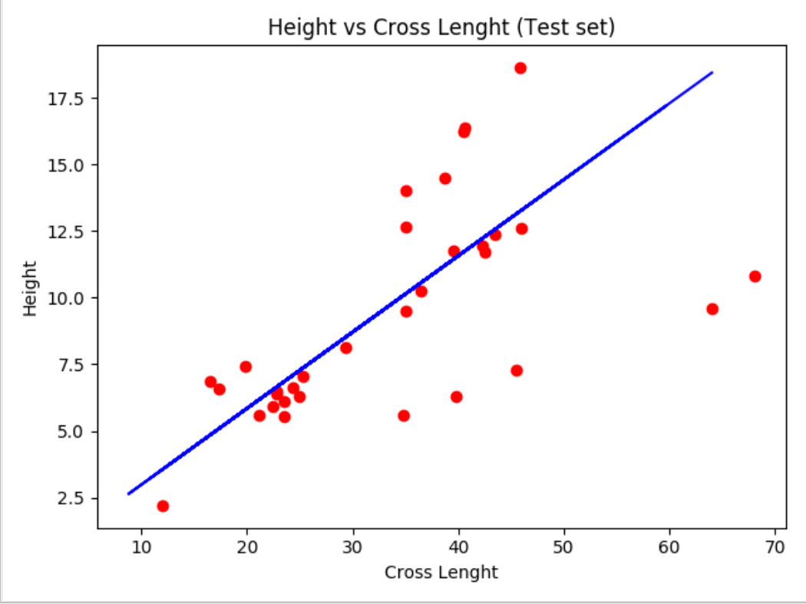

# Fish Cross Lenght & Height Analysis

I am following A - Z Machine Learning course on udemy. This week I learned Simple and Multiple Linear Regression. I used linear regression to predict relation between fish cross lenght and height. 

